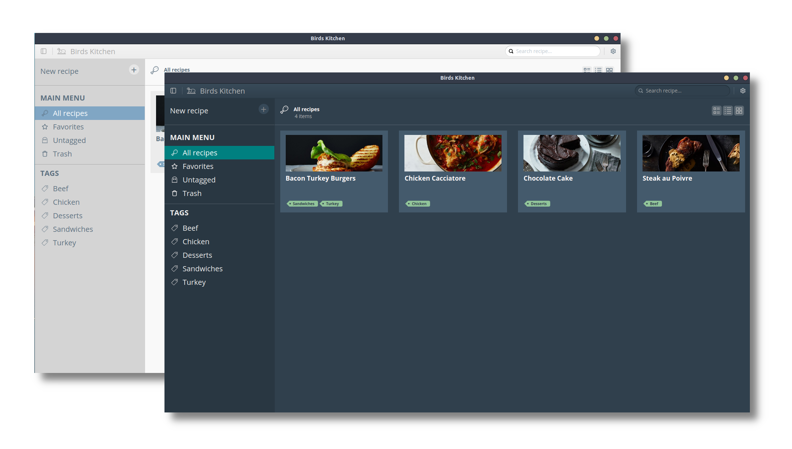
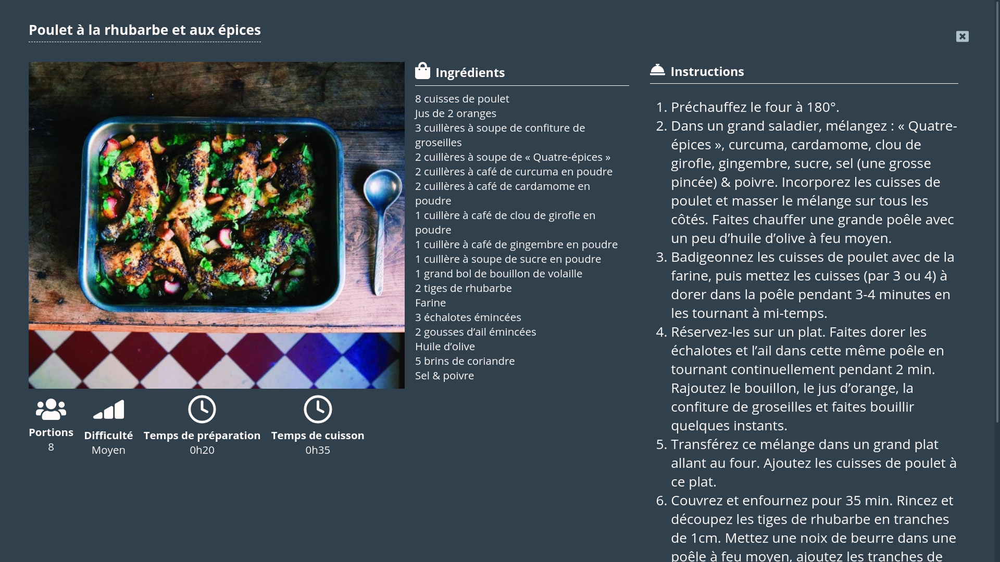
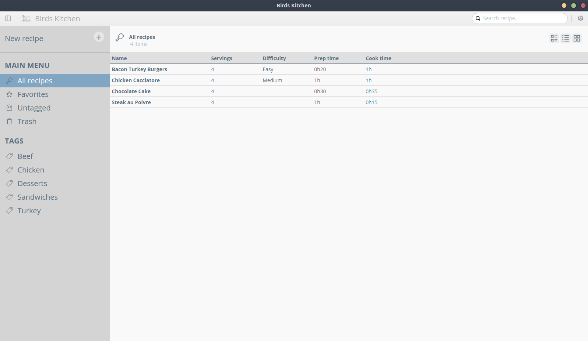

# Birds Kitchen

#### ⚠️ The project is under early development, many bugs and architect changes are expected.

I wanted to learn something new...

So, this is an attempt to create a Desktop Recipe Manager application using Electron and React.

I you want to contribute, please send me a mail or a pidgeon :grin:

<a href="mailto:contact@tenbirds.online"></a>

## Screenshots

<p align="center">
    
</p>

&nbsp;

<p align="center">
    
</p>

&nbsp;

<p align="center">
    
</p>

## Features

- Cross platform (Linux and Mac OS binaries for now)
- Localized
- Custom Themes (a light one and a dark one for now)
- Content search
- Tags
- Favorites
- Print current recipe
- Choose your storage directory (including Sync Services)
- Backups and Restore backups

## Roadmap

- [ ] Grocery List
- [ ] Auto updates
- [ ] Link to Recipe source

## Running locally

### Binaries
**Visit the [Releases Page](https://github.com/fredserva/birdskitchen/releases) to find the installer you need.** 

### Building from source
```bash
# clone the project
git clone https://github.com/fredserva/birdskitchen.git

# change directory to the project folder
cd birdskitchen

# install dependencies
yarn

# run the app in development mode
yarn dev
```

## Contributing

To add support for your favorite language, or submit new features, feel free to open an issue or to contact me directly.
**Contributions are very welcomed!**

## License

GPL v3 license

## Buy me a coffee! (or more likely a beer)

[Yes, do that!](https://paypal.me/fredserva)

