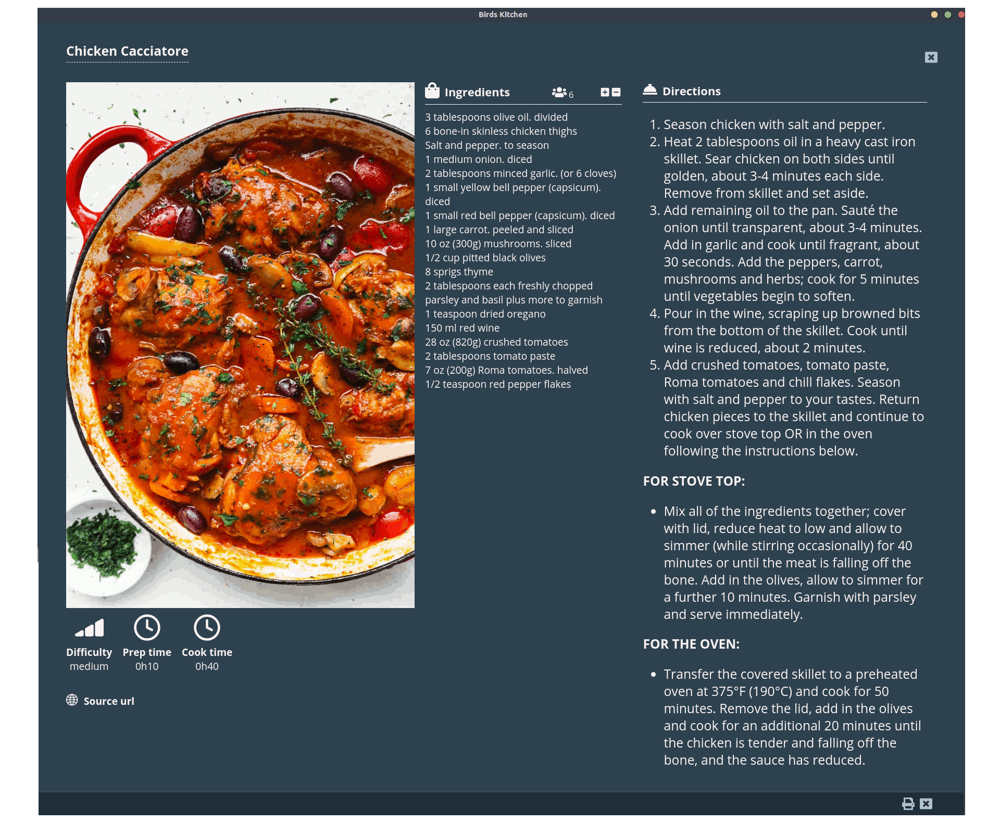
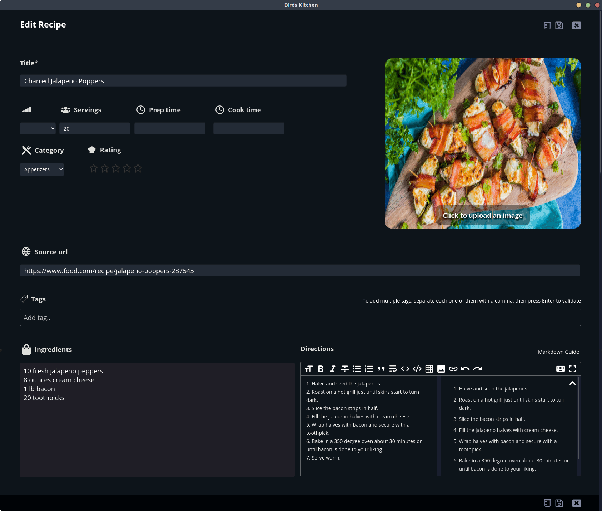
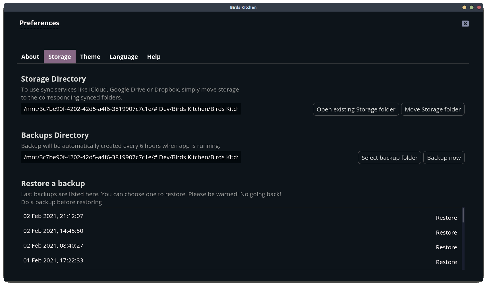
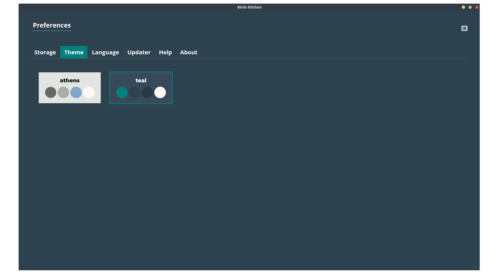

# Birds Kitchen

[](https://creativecommons.org/licenses/by-nc-nd/4.0/) []()


**Love Birds Kitchen? Give this repo a star :star:**

&nbsp;

---
&nbsp;
## Website
<a href="https://tenbirds.online/birdskitchen/">https://tenbirds.online/birdskitchen/</a>

&nbsp;

---
&nbsp;

I wanted to learn something new...

So, I decided to take a crack at learning React and building an application that I found deeply missing in Linux: a Desktop Recipe Manager (I know there is some, but they don't match my needs...)

I you want to contribute, please send me a mail or a pidgeon :grin:

<a href="mailto:contact@tenbirds.online"></a>

## Screenshots

&nbsp;

**Dark and light theme - Grid view**
<p align="center">
    
</p>

&nbsp;

**Image list view**
<p align="center">
    
</p>

&nbsp;

**Table view**
<p align="center">
    
</p>

&nbsp;

**Print view**
<p align="center">
    
</p>

&nbsp;

**Edit view**
<p align="center">
    
</p>

&nbsp;

**Preferences screen - Storage tab**
<p align="center">
    
</p>

&nbsp;

**Preferences screen - Theme tab**
<p align="center">
    
</p>

## Features

- Cross platform
- Localized (english, french, german and italian)
- Custom Themes (a light one and two dark ones for now)
- Content search
- Tags
- Categories
- Ratings
- Favorites
- Source URL
- Table view with column sorting
- Change the ingredients amounts when adjusting the servings (ready to print view)
- Print current recipe
- Choose your storage directory (including Sync Services)
- Backups and Restore backups
- Unit Converter
- Recipe Websites scraper (54 supported websites in 4 languages)
- Auto updates

## Roadmap

**Visit the [Roadmap Page](https://github.com/fredserva/birdskitchen/projects/2?fullscreen=true) for details...**

## Running locally

### Binaries
**Visit the [Releases Page](https://github.com/fredserva/birdskitchen/releases) to find the installer you need.** 

### Building from source
```bash
# clone the project
git clone https://github.com/fredserva/birdskitchen.git

# change directory to the project folder
cd birdskitchen

# install dependencies
yarn

# run the app in development mode
yarn dev
```

## Contributing

To add support for your favorite language, or submit new features, feel free to open an issue or contact me directly.
**Contributions are very welcomed!**

## License

[](https://creativecommons.org/licenses/by-nc-nd/4.0/)

## Buy me a coffee! (or more likely a beer)

[Yes, do that!](https://paypal.me/fredserva)


---
&nbsp;

## Contributors

Thanks goes to these people

<table>
  <tr>
    <td>
        <a href="https://github.com/YSchroe"><br /><b>YSchroe</b></a><br />German translation
    </td>
    <td>
        <a href="https://github.com/albanobattistella"><br /><b>Albano Battistella</b></a><br />Italian translation
    </td>
  </tr>
</table>